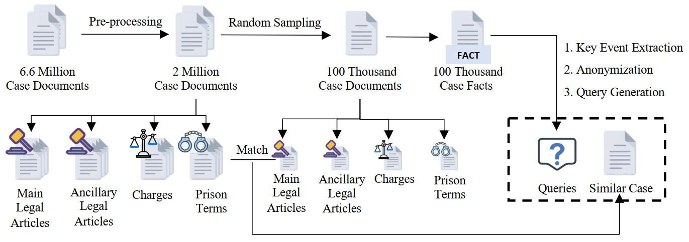
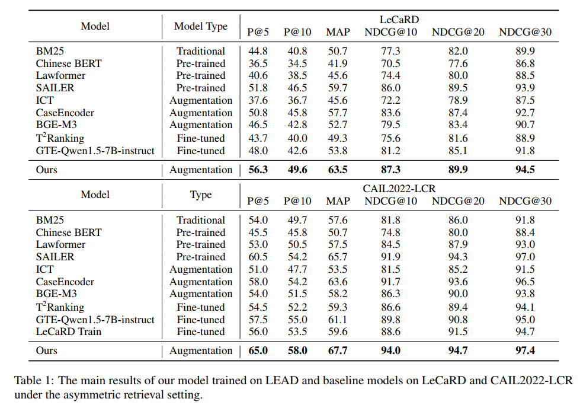

# Enhancing Legal Case Retrieval via Scaling High-quality Synthetic Query-Candidate Pairs (LEAD)

<p align="center">
  <a href="#features">Features</a> •
  <a href="#Introduction">Introduction</a> •
  <a href="#Dataset">Dataset</a> •
  <a href="#Install">Install</a> •
  <a href="#Training">Training</a> •
  <a href="#Evaluation">Evaluation</a> •
</p>


This repo is based on the following paper:

Cheng Gao\*, Chaojun Xiao\*, Zhenghao Liu, Huimin Chen, Zhiyuan Liu, Maosong Sun. [Enhancing Legal Case Retrieval via Scaling High-quality Synthetic Query-Candidate Pairs](https://arxiv.org/abs/2410.06581). Proceedings of the 2024 Conference on Empirical Methods in Natural Language Processing (EMNLP).

## Features
1. The largest high-quality, asymmetric legal case retrieval (LCR) datasets to date, containing 100,060 pairs of similar cases.
2. Relevant tools for data preprocessing, model training and evaluation.
3. The model trained using this dataset achieved state-of-the-art performance in Chinese LCR, and the model checkpoint is included in this repository.

## Introduction
Existing works mainly focus on case-to-case retrieval using lengthy queries, which does not match real-world scenarios; and the limited data scale, with current datasets containing only hundreds of queries, is insufficient to satisfy the training requirements of existing data-hungry neural models. 

To address these issues, we introduce an automated method to construct synthetic query-candidate pairs and build the largest LCR dataset to date, LEAD, which is hundreds of times larger than existing datasets. 



Specifically, given a case candidate, we employ a large-scale generative language model to first extract key facts, and omit entities, including names and places.
Then, based on the anonymous key fact, we require the model to generate a brief and coherent description of the case, which is regarded as the search query. In this way, the generated query is short and contains only a few sentences.
Additionally, to improve data diversity and enable the model to retrieve relevant cases even when key facts are not entirely consistent, we employ a knowledge-driven data augmentation strategy. For each query, we select the case that is most similar from the perspective of charges, related legal articles, and prison term, from the entire corpus as the augmented positive candidate.



Our model outperforms all baselines on LeCaRD and CAIL2022 by a large margin, achieving state-of-the-art performance. It indicates that using larger-scale and more comprehensive LCR data can greatly benefit task performance, which emphasizes the importance of developing data augmentation methods for LCR.

## Dataset

You can find the LEAD dataset [here](https://huggingface.co/datasets/JamesChengGao/LEAD). 0, 30, 65, and 100 in the file names represent the proportion of query-key pairs that belong to the same case. Please refer to the ablation section of [our paper](https://arxiv.org/abs/2410.06581) for more details.

The simplified version of LeCaRD queries is in `LeCaRD/data/query/query_simplify.json` and the simplified version of CAIL2022 queries is in `CAIL2022/stage2/query_stage2_valid_onlystage2_40_simplified.json`. In both files, “q” represents the original queries of the datasets, while “q_short” represents the simplified queries.

Candidate cases of LeCaRD are located in `LeCaRD/data/candidates/similar_case` and candidate cases of CAIL2022 are located in `CAIL2022/stage2/candidates_stage2_valid`.

Labels of LeCaRD are located in `LeCaRD/data/label/label_top30_dict.json` and labels of CAIL2022 are located in `CAIL2022/label/label_1.json`.

#### Data Description

```
 [
 	{
            "uniqid": "...",
            "title": "...",
            "SS": "...",
            "query": "...",
            "key": "...",
            "AJAY": [..., ...],
            "AJDY": ...,
            "LY": "...",
            "JG": "...",
            "path": "...",
            "Main article": "['...', '...', '...']",
            "other article": "['...', '...', '...']",
            "sentence": "...",
            "similar case": "..."
    },
    ...
]
```

This section introduces only the important key names in the dataset.

-  **SS**: Description of the case, detailing the incident, the accused's actions, and the prosecution's claims. This section includes specific dates, locations, and circumstances surrounding the alleged crime. 
- **query**: A brief summary of **SS**. When training the model, this section, along with **key**, will form the query-key pairs.
- **key**: If the query and key of a pair are generated from the same case, the **key** section will be exactly the same as **SS**. Otherwise, the **key** section will be the same as **Similar Case**.
- **AJAY**: Each number in this list represents a charge in this case. The correspondence between the numbers and the charges can be found in ```LEAD_data/mapping_v2.json```
- **main article**: A list of relevant legal articles of *Chinese Criminal Law* referenced by this case. 
- **other article**: An list of ancillary legal articles of *Chinese Criminal Law* referenced by this case. 
- **sentence**: The length of the sentence imposed on the defendant. 
- **similar case**: A detailed description of a case that shares similarities with the current case.

#### Key Event Extraction

To generate data pairs from raw legal data, we first use a large-scale generative language model to create brief summaries of the cases. If you want to repeat this step, please refer to `raw_data/process_data_LLM.py`. The prompt we used is also provided in this file. And you will need to implement your own model response method. note that this is just a simple implementation for generating brief summaries from Chinese criminal cases (In ```raw_data/xs```, we provide a few samples of them. To download more raw data, please visit https://wenshu.court.gov.cn), and you can modify the content as needed.

#### Anonymization

We use [DeepTHULAC](https://github.com/thunlp/DeepTHULAC) to further eliminate legally irrelevant entities from the cases generated in the previous step. ```raw_data/deepthulac_cut.py``` and ```raw_data/deepthulac_anonymization.py``` are two simple examples of using DeepTHULAC for part-of-speech tagging and anonymization on the cases. For more details, please refer to their repository.

#### Similar Case Match

We search for a similar case for each case based on the Main legal articles, ancillary legal articles, sentences, and charges. The specific method is as follows: first, for a given case, we search for cases with the same charges and Main legal articles as  it. Among these cases, we then find the one with the most similar ancillary legal articles (using edit distance for comparison). Finally, from the remaining cases, we look for the one with the closest sentences, and if multiple cases remain, we randomly select one.


## Install

**The training code framework is derived from [DPR](https://github.com/facebookresearch/dpr).** For environment requirements, please follow:

```bash
git clone git@github.com:facebookresearch/DPR.git
cd DPR
pip install .
```

Then clone our repo:

```sh
git clone git@github.com:thunlp/LEAD.git
cd LEAD
```

## Training

In order to start training, please change the path in ```train_encoder_LCR.sh``` to your local path, then:

```shell
sh train_encoder_LCR.sh
```

Note:

- This only supports training data that is formatted exactly the same as previously described. If you wish to use your own formatted training data, please refer to `dpr/data/biencoder_data.py > LCRDataset` to implement your own data processing function. Then, register this class in `conf/datasets/encoder_train_default.yaml`. Finally, change `train_datasets=[Law_data_train]` and `dev_datasets=[Law_data_dev]` in `train_encoder_LCR.sh` to the names you have registered.
- We have implemented false negative masking strategy (see our [paper](https://arxiv.org/abs/2410.06581) for details). If you do not wish to use this strategy, please refer to the comments in `train_encoder_LCR.sh` to disable it.
- The default model file is `dpr/models/hf_models.py`, which implements the Longformer model architecture. The implementation of DPR’s original BERT model architecture can be found in `dpr/models/hf_models_bert.py`.

## Evaluation

To test on CAIL2022, Please first unzip CAIL2022 candidate files:

```sh
cd CAIL2022/stage2
unzip candidates_stage2_valid.zip
```

For LeCaRD candidates files, you need to first download 2 compressed files of candidates files [here](https://github.com/myx666/LeCaRD/tree/main/data/candidates), and add it to `LeCaRD/data/candidates/similar_case`, then:

```sh
cd LeCaRD/data/candidates/similar_case
unzip candidates1.zip
unzip candidates2.zip
```

In order to start evaluation, please first change the path in `generate_dense_embeddings.sh` and `dense_retriever.sh`, then:

```shell
sh generate_dense_embeddings.sh
```

This will utilize the model you trained to create vector representations for LeCaRD or CAIL2022. Following that:

```shell
sh dense_retriever.sh
```

This will generate similarity scores for cases based on the cosine similarity between vectors. At this point, you will need to modify the path in `process_results.py`, and then:

```shell
python process_results.py
```

This will compile a JSON file:

````json
{"20": [21982, 38850, 13, ...], ...}
````

This indicates that for the query case with ridx 20, the highest similarity score is for the case with ridx 21982, followed by the case with ridx 38850, and so on. After generating this file, `process_results.py` will automatically run the LeCaRD evaluation code for you (Before doing this you should change the path to the label file of LeCaRD and CAIL2022 in `LeCaRD/metrics.py`).

Of course, you can also run this code yourself:

```
python LeCaRD/metrics.py
```

Notes:

- The scripts `generate_dense_embeddings.sh` and `dense_retriever.sh` are configured by default to only support checkpoints trained with this repository. If you wish to evaluate other models, please refer to the implementations in `generate_dense_embeddings.py` and `dense_retriever.py` and modify `is_DPR_checkpoint` and `from_pretrained` parameters in the sh files.
- For details on LeCaRD and CAIL2022, please see [LeCaRD](https://github.com/myx666/LeCaRD). The implementation in `LeCaRD/metrics.py` is derived from this repository. However, we have introduced two evaluation standards: easy and hard. The easy standard evaluates only on the 30 manually annotated cases for each query, while the hard standard treats the remaining 70 unannotated cases as non-relevant and evaluates across all 100 cases.
- During evaluation, we implemented a document segmentation strategy, where documents exceeding the sequence length are split into several document blocks. The score of the most similar document block is then used as the score for the entire document. Please refer to `dpr/models/hf_models.py > BertTensorizer` and `dpr/indexer/faiss_indexers.py > DenseFlatIndexer` for this part.
- Since each query case in LeCaRD and CAIL2022 has its own candidate pool, which is inconsistent with DPR’s implementation, we adopted a more naive approach during evaluation. This involves calling `generate_dense_embeddings.py` and `dense_retriever.py` once for each query case in the sh script. Apparently this method is not efficient for evaluation. If you wish to improve the efficiency of the evaluation, you can implement the related functionality in the code.
- We also provide the checkpoint of our [best-trained model](https://huggingface.co/JamesChengGao/LEAD-model), encoded files (`encoded/encoded_ctx_2048_xs30original_fp16_train_globalmask_1e-5_70epochs`), and evaluation results (`result/result_LeCard/results_2048_xs30original_fp16_train_globalmask_1e-5_70epochs.zip` and `DPR_rank/DPR_rank_LeCard/DPR_rank_2048_xs30original_fp16_train_globalmask_1e-5_70epochs.json`).

## License

LEAD is MIT licensed as of now.

## Citation

If you find this work useful, please cite the following paper:

```
@inproceedings{gao-etal-2024-enhancing-legal,
    title = "Enhancing Legal Case Retrieval via Scaling High-quality Synthetic Query-Candidate Pairs",
    author = "Gao, Cheng  and
      Xiao, Chaojun  and
      Liu, Zhenghao  and
      Chen, Huimin  and
      Liu, Zhiyuan  and
      Sun, Maosong",
    editor = "Al-Onaizan, Yaser  and
      Bansal, Mohit  and
      Chen, Yun-Nung",
    booktitle = "Proceedings of the 2024 Conference on Empirical Methods in Natural Language Processing",
    month = nov,
    year = "2024",
    address = "Miami, Florida, USA",
    publisher = "Association for Computational Linguistics",
    url = "https://aclanthology.org/2024.emnlp-main.402",
    pages = "7086--7100",
}
```

